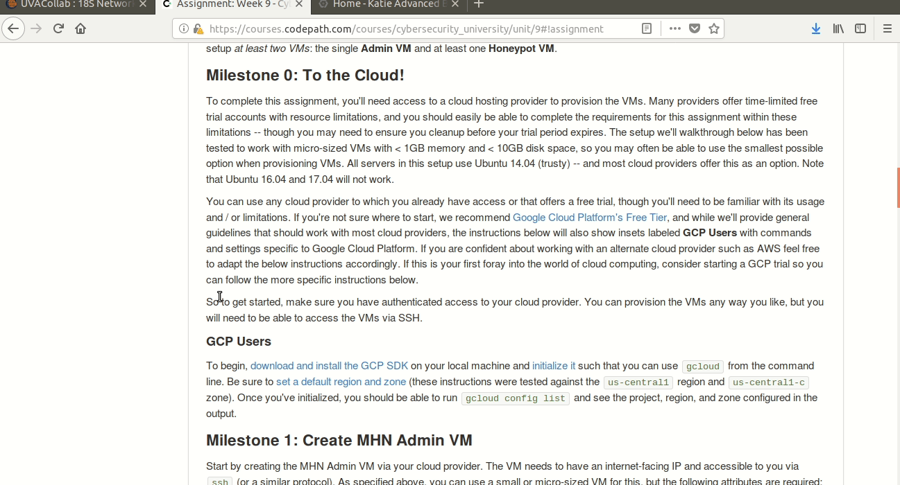
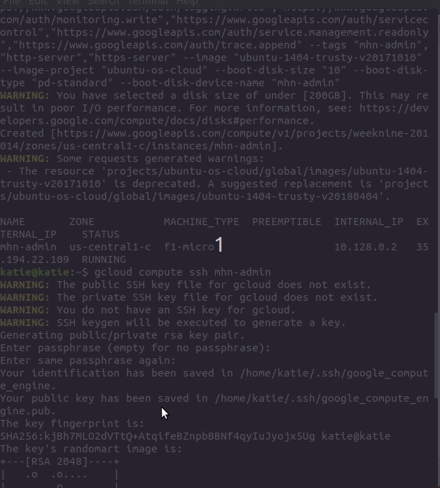
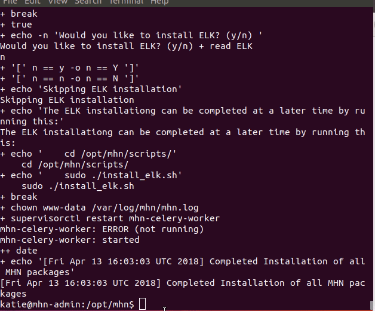

# Project 9 - Honeypot

Time spent: **6** hours spent in total

> Objective: Setup a honeypot and intercept some attempted attacks in the wild.
In this assignment, you will stand up a basic honeypot and demonstrate its effectiveness at detecting and/or collecting data about an attack. Guided instructions for doing this using specific software are provided below, but you are free to take any approach you wish that demonstrates the following basic principles:

    Successful configuration and deployment of a network-accessible honeypot server with two primary features:
        An attack surface that is vulnerable or exposed in some way to network-based attacks
        A network security feature such as an IDS configured to detect and log such attacks
    Illustration of at least one attack against the honeypot that can be detected or logged in a way that captures information about the attack or the attacker

## Milestone 0: To the Cloud!

- [x] To complete this assignment, you'll need access to a cloud hosting provider to provision the VMs: 

## Milestone 1: Create MHN Admin VM

- [x] Start by creating the MHN Admin VM via your cloud provider: 

## Milestone 2: Install the MHN Admin Application

- [x] After having established SSH access the MHN Admin VM, the following instructions can be run on the remote VM to install the application: 

## Milestone 3: Create a MHN Honeypot VM

- [ ] MHN supports multiple honeypots, each of which has a slightly different purpose you can read about. To start, we'll deploy Dionaea over HTTP, a honeypot used to trap malware samples:

## Milestone 4: Install the Honeypot Application

- [ ] After having established SSH access the new honeypot VM, we need to install the honeypot application into the VM and wire it to connect back to the admin server:

## Milestone 5: Attack!

- [ ] Now for the fun part: let's attack the honeypot to make sure it's all working:

## Notes

Describe any challenges encountered while doing the work
